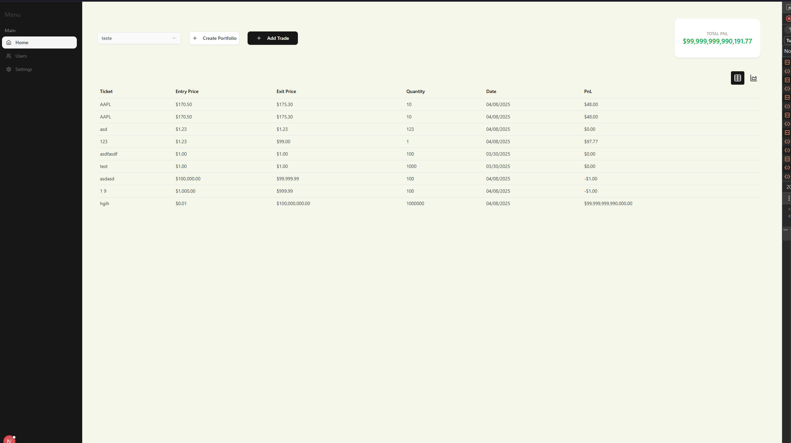

# Portfolio and Trades

## How to run this project

You must have the API running: https://github.com/jamesDockal/trade-portfolio-api

Recommend version of Nodejs: 22  
`yarn install` 
`yarn dev`

This will start a localhost instance in port 3000, `http://localhost:3000`

## Tech used

- NextJs
- Typescript
- Tailwind
